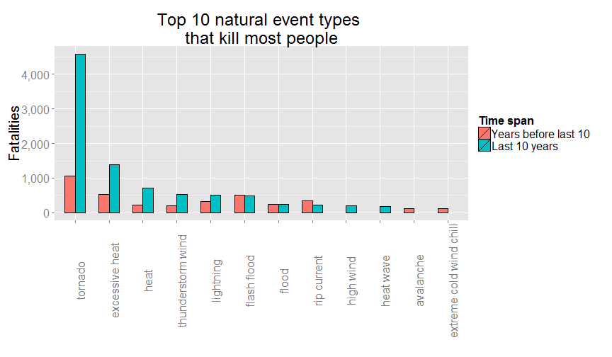
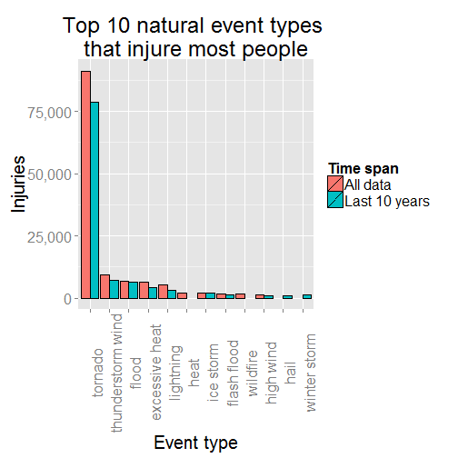
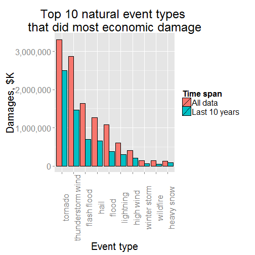

A ranking of the worst kinds of natural events
==============================================

## Synopsis

This is a look at a [data set of weather events](https://d396qusza40orc.cloudfront.net/repdata/data/StormData.csv.bz2) collected by the National Weather Service. I consider three types of damage: human fatalities, injuries, and economic damages -- which I define as the sum of property and crop damages. On all three margins, __tornadoes__ top the charts. The runner-up is __excessive heat__ for fatalities, and __thunderstorm wind__ for injuries and economic damage.

This report is code-generated such that the rankings shown below can be produced for any top _n_ worst events (parameter `myn`, currently set to 10) for the data set split into two: one subset covers a given number of _y_ most recent years (parameter `myy`, currently also set to 10) and all previous years.

## Data Processing

### Toolkit

Some third-party libraries are needed, as well as a specific R internal setting as shown in the code chunk below:


```r
require(data.table) # for faster summary stats
```

```
## Loading required package: data.table
```

```r
require(reshape)    # for setting up for ggplot2
```

```
## Loading required package: reshape
```

```r
require(ggplot2)    # for plotting
```

```
## Loading required package: ggplot2
```

```r
require(scales)     # for pretty numbers on plots
```

```
## Loading required package: scales
```

```r
setInternet2(TRUE)  # for https downloads.

# So that data.table won't trick knitr into printing the data:
# (http://stackoverflow.com/questions/15267018/knitr-gets-tricked-by-data-table-assignment)
assign("depthtrigger", 80, data.table:::.global)

myn <- 10 # Top myn causes of injuries, fatalities. Set to suit.
myy <- 10 # Most recent years of data to consider separately. Set to suit.
```

### Data

No data is saved to disk. Instead, it is downloaded as a temporary file and summarily pre-processed as an in-memory data frame.


```r
here  <- tempdir()
myurl <- 'https://d396qusza40orc.cloudfront.net/repdata/data/StormData.csv.bz2'
data  <- paste(here,'StormData.csv.bz2',sep='/')
download.file(myurl,data)
data <- data.table(read.csv(data, stringsAsFactors=FALSE))

# Transform the date of interest from string to true date
data$BGN_DATE <- as.Date(sapply(data$BGN_DATE,
                                function(x) {
                                    unlist(strsplit(x," "))[1]
                                }),"%m/%d/%Y")
```

### Clean-up

One readily apparent problem with the data is that event types are not consistently named. This, if left unattended, might make summaries by event type inaccurate. 

For example, there are 985 unique event values in the data set, but if EVTYPE is forced to all lowercase there remain 898 of them. This would be an easy fix, but there are also plurals, idiosyncratic spaces (e.g. "W IND"), typos, and an amazing variety of ways to spell "thunderstorm". Some of these things can be fixed with regular-expression matching, as below:


```r
# Keep only true event types, not summaries
data <- subset(data, !(EVTYPE %in% EVTYPE[grep('^(summary|monthly)',EVTYPE,ignore.case=TRUE)]))

# Things I'm going to do to EVTYPE
events <- tolower(data[,EVTYPE])
foo <- length(unique(events))
events <- gsub('\\\\|&|/|(-\\s)|\\s+|;',' ',events)
events <- gsub('\\s+',' ',events)
events <- gsub('^\\s','',events)
events <- gsub('\\s$|-$|\\.$','',events)
events <- gsub('(wintery|wintry)','winter',events)
events <- gsub('micoburst','microburst',events)
events <- gsub('wayterspout','waterspout',events)
events <- gsub('waterspout-tornado','waterspout tornado',events)
events <- gsub('flooding|fldg|fld|floodin','flood',events)
events <- gsub('(sml stream)|(small strm)','small stream',events)
events <- gsub('tstm|thunderstrom|thunerstorm|thundertsorm|
               thundertorm|thundestorm|thuderstorm','thunderstorm',events)
events <- gsub('tunderstorm|thunderestorm|thundeerstorm|
               thunderstorms|thundertorm','thunderstorm',events)
events <- gsub('thunderstorms','thunderstorm',events)
events <- gsub('thunderstorm w inds','thunderstorm wind',events)
events <- gsub('thunderstormw winds','thunderstorm wind',events)
events <- gsub('thunderstormwinds','thunderstorm wind',events)
events <- gsub('(thunderstorm wnd)|(thunderstorm wins)',
               'thunderstorm wind',events)
events <- gsub('(thunderstorm damage)|(thunderstorm damage to)','thunderstorm',events)
events <- gsub('thunderstorm wind.+','thunderstorm wind',events)
events <- gsub('thunderstormw.+|thunderstormw','thunderstorm',events,perl=TRUE)
events <- gsub('wild fire','wildfire',events)
events <- gsub('unseasonal|unseasonable','unseasonably',events)
events <- gsub('tornados|torndao|tornadoes','tornado',events)
events <- gsub('tornado f.','tornado',events)
events <- gsub('^hail\\s[0-9]+','hail',events)
events <- gsub('^hail\\.[0-9]+','hail',events)
events <- gsub('^hail\\(0\\.[0-9]+\\)','hail',events)
events <- gsub('^high winds\\s[0-9]+','high winds',events)
events <- gsub('^high wind\\s[0-9]+','high wind',events)
events <- gsub('^high wind\\s\\([a-z][0-9]+\\)','high wind',events)
events <- gsub('^high winds','high wind',events)
events <- gsub('^dry microburst\\s[0-9]+','dry microburst',events)
events <- gsub('wnd','wind',events)
events <- gsub('winds$','wind',events)
events <- gsub('fires$','fire',events)
events <- gsub('storms$','storm',events)
events <- gsub('chil$','chill',events)
events <- gsub('win$','wind',events)
events <- gsub('waterspouts$|(water spout)','waterspout',events)
events <- gsub('rain \\(heavy\\)','heavy rain',events)
events <- gsub('lake-effect','lake effect',events)
events <- gsub(' \\(minor$','',events)
events <- gsub('snow-squalls','snow squalls',events)
events <- gsub('(heavy rains)|(heavy rainfall)','heavy rain',events)
events <- gsub('andblowing snow','blowing snow',events)
events <- gsub('and','',events)
events <- gsub('cstl','coastal',events)
events <- gsub('erosin','erosion',events)
events <- gsub(' and$','',events)
events <- gsub('squalls$','squall',events)
events <- gsub('coastalflood','coastal flood',events)
events <- gsub('coastalstorm','coastal storm',events)
events <- gsub('\\s+|,',' ',events)
events <- gsub('lslides','lslide',events)
events <- gsub('(\\s|\\))$','',events)
events <- gsub('precip$','precipitation',events)
events <- gsub('rip currents','rip current',events)
events <- gsub('wild forest fire','wildfire',events)
bar <- length(unique(events))

data[,EVTYPE:=events] # make all a consistent case
```

Excluding summaries, I started with 828 unique event types, and after tidying up a bit as shown above, I ended up with 545 unique event types. I'm not claiming that I caught every source of event type confusion, but surely this is an improvement over the original set.

## Calculations

We need to do a bit of setting up. First, input data must be aggregated into analytic data and some functions that will be called for producing inline numbers must be pre-defined.

```r
oldest <- min(year(data$BGN_DATE))
newest <- max(year(data$BGN_DATE))
oldesty <- subset(data,year(BGN_DATE) %in% c(oldest:oldest+(myy-1)))
newesty <- subset(data,year(BGN_DATE) %in% c(newest-(myy-1):newest))
balance <- subset(data,!(year(BGN_DATE) %in% c(newest-(myy-1):newest)))

# summarize data: add losses of interest by event type.
# returns: a data table.
getLossSum <- function(dt) {
    out <- dt[,list(fatalities=sum(FATALITIES), 
                    injuries=sum(INJURIES),
                    cropdmg=sum(CROPDMG),
                    propdmg=sum(PROPDMG)),
              by=list(EVTYPE)]
    out[,econdmg:=cropdmg+propdmg]
    return(subset(out,select=-c(cropdmg,propdmg)))
}

# report damage. 2 arguments:
# dt -- a data table summarized by getLossSum()
# thisn -- how many observations in the head() call
#
# Returns: a list with as many elements as there are
# metrics of interest. In this case, 3:
# fatalities, injuries, econdmg.
# each element is a data table.
getLoss <- function(dt,thisn=myn) {
    myx <- setdiff(names(dt),'EVTYPE')
    getTopset <- function(x) {
        return(head(subset(dt,select=c(EVTYPE,get(x)))[order(-get(x)),],n=thisn))
    }
    out <- lapply(myx,FUN=getTopset)
    names(out) <- myx
    return(out)
}

# get share of event types listed
# in string vector e for loss x
# in data table dt. This function
# will be called by in-line code.
#
# returns: a value between 0 and 1.
getShareOfLoss <- function(e,x,dt) {
    num <- sum(dt[,get(x)][dt[,EVTYPE] %in% e],na.rm=TRUE)
    den <- sum(dt[,get(x)],na.rm=TRUE)
    return(num/den)
}

# get top losses from lists produced by getLoss()
# pair newest myy years' of losses with either (1)
# losses from all data combined or (2) losses from
# previous years.
#
# returns: a data table sorted by the variable
# specified in the sortby argument
getLossTable <- function(x,all,new,prefix='all',sortby=paste(prefix,x,sep='.')) {
    out <- merge(all[[x]],new[[x]],by=c('EVTYPE'),all=TRUE)
    oldnames <- c('EVTYPE',paste(x,'x',sep='.'),paste(x,'y',sep='.'))
    newnames <- c('EVTYPE',paste(prefix,x,sep='.'),paste('last',myn,'years',sep='.'))
    setnames(out,oldnames,newnames)
    return(out[order(-get(sortby)),])
}

# Get summarized data tables. 
# This is the analytical data.
peoplesum <- getLossSum(data)    # all data
peoplenew <- getLossSum(newesty) # only latest myy years
peoplebal <- getLossSum(balance) # only years before latest myy years
```

Next, `ggplot2` bar plots can be drawn and saved for showing later. This requires some further data processing first.


```r
allLoss <- getLoss(peoplesum)
newLoss <- getLoss(peoplenew)
oldLoss <- getLoss(peoplebal)

# all vs. new
fatalities <- getLossTable('fatalities',allLoss,newLoss)
injuries   <- getLossTable('injuries',allLoss,newLoss)
econdmg    <- getLossTable('econdmg',allLoss,newLoss)
overlap    <- intersect(fatalities$EVTYPE[!is.na(fatalities[[2]])],
                        injuries$EVTYPE[!is.na(injuries[[2]])])

# this will help ggplot2 bar plot order
fatalities[,EVTYPE:=factor(EVTYPE,levels=fatalities[,EVTYPE])]
injuries[,EVTYPE:=factor(EVTYPE,levels=injuries[,EVTYPE])]
econdmg[,EVTYPE:=factor(EVTYPE,levels=econdmg[,EVTYPE])]

# old vs. new
fatalities1 <- getLossTable('fatalities',oldLoss,newLoss,
                           prefix='old',
                           sortby=paste('last',myn,'years',sep='.'))
injuries1   <- getLossTable('injuries',oldLoss,newLoss,
                           prefix='old',
                           sortby=paste('last',myn,'years',sep='.'))
econdmg1    <- getLossTable('econdmg',oldLoss,newLoss,
                           prefix='old',
                           sortby=paste('last',myn,'years',sep='.'))
overlap1    <- intersect(fatalities1$EVTYPE[!is.na(fatalities1[[3]])],
                         injuries1$EVTYPE[!is.na(injuries1[[3]])])

# again, this is just for bar plot order
fatalities1[,EVTYPE:=factor(EVTYPE,levels=fatalities1[,EVTYPE])]
injuries1[,EVTYPE:=factor(EVTYPE,levels=injuries1[,EVTYPE])]
econdmg1[,EVTYPE:=factor(EVTYPE,levels=econdmg1[,EVTYPE])]

# draw pictures, but don't show them yet. two sets:

# 1. bar plots of all vs new
pf <- ggplot(data=melt(fatalities,id=1), aes(x=EVTYPE, y=value, fill=variable)) + 
    geom_bar(stat="identity", position=position_dodge(), colour="black") + 
    scale_y_continuous(name="Fatalities",labels=comma) +
    scale_x_discrete(name="Event type") +
    scale_fill_discrete(name="Time span",
                        labels=c("All data",paste("Last",myy,"years",sep=" "))) +
    ggtitle(paste("Top",myn,
                  "natural event types \nthat kill most people",sep=" ")) +
    theme(text = element_text(size=20), 
    axis.text.x = element_text(angle=90, vjust=1))


pi <- ggplot(data=melt(injuries,id=1), aes(x=EVTYPE, y=value, fill=variable)) + 
    geom_bar(stat="identity", position=position_dodge(), colour="black") + 
    scale_y_continuous(name="Injuries",labels=comma) +
    scale_x_discrete(name="Event type") +
    scale_fill_discrete(name="Time span",
                        labels=c("All data",paste("Last",myy,"years",sep=" "))) +
    ggtitle(paste("Top",myn,
                  "natural event types \nthat injure most people",sep=" ")) +
    theme(text = element_text(size=20), 
    axis.text.x = element_text(angle=90, vjust=1))

pe <- ggplot(data=melt(econdmg,id=1), aes(x=EVTYPE, y=value, fill=variable)) + 
    geom_bar(stat="identity", position=position_dodge(), colour="black") + 
    scale_y_continuous(name="Damages, $K",labels=comma) +
    scale_x_discrete(name="Event type") +
    scale_fill_discrete(name="Time span",
                        labels=c("All data",paste("Last",myy,"years",sep=" "))) +
    ggtitle(paste("Top",myn,
                  "natural event types \nthat did most economic damage",sep=" ")) +
    theme(text = element_text(size=20), 
    axis.text.x = element_text(angle=90, vjust=1))

# 2. bar plots of old vs. new
pf1 <- ggplot(data=melt(fatalities1,id=1), aes(x=EVTYPE, y=value, fill=variable)) + 
    geom_bar(stat="identity", width=.6,
             position=position_dodge(), colour="black") + 
    scale_y_continuous(name="Fatalities",labels=comma) +
    scale_x_discrete(name="") +
    scale_fill_discrete(name="Time span",
                        labels=c(paste("Years before last",myy,sep=" "),
                                 paste("Last",myy,"years",sep=" "))) +
    ggtitle(paste("Top",myn,
                  "natural event types \nthat kill most people",sep=" ")) +
    theme(text = element_text(size=20), 
    axis.text.x = element_text(angle=90, vjust=1))


pi1 <- ggplot(data=melt(injuries1,id=1), aes(x=EVTYPE, y=value, fill=variable)) + 
    geom_bar(stat="identity", width=.6,
             position=position_dodge(), colour="black") + 
    scale_y_continuous(name="Injuries",labels=comma) +
    scale_x_discrete(name="") +
    scale_fill_discrete(name="Time span",
                        labels=c(paste("Years before last",myy,sep=" "),
                                 paste("Last",myy,"years",sep=" "))) +
    ggtitle(paste("Top",myn,
                  "natural event types \nthat injure most people",sep=" ")) +
    theme(text = element_text(size=20), 
    axis.text.x = element_text(angle=90, vjust=1))

pe1 <- ggplot(data=melt(econdmg1,id=1), aes(x=EVTYPE, y=value, fill=variable)) + 
    geom_bar(stat="identity", width=.6, 
             position=position_dodge(), colour="black") + 
    scale_y_continuous(name="Damages, $K",labels=comma) +
    scale_x_discrete(name="") +
    scale_fill_discrete(name="Time span",
                        labels=c(paste("Years before last",myy,sep=" "),
                                 paste("Last",myy,"years",sep=" "))) +
    ggtitle(paste("Top",myn,
                  "natural event types \nthat did most economic damage",sep=" ")) +
    theme(text = element_text(size=20), 
    axis.text.x = element_text(angle=90, vjust=1))
```

## Results

### Ranking of event types by injuries and fatalities

There are 545 event types in the StormData data set, tracked over 61 years, between 1950 and 2011. These events were responsible for 15,145 fatalities and 140,528 injuries. Over time, the number of event types tracked grew from 3 over the first 10 years data to 534 over the last 10.

The overlapping subset of the top 10 types of weather events that kill or injure most people counted over the complete data set:

```r
t(t(overlap))
```

```
##      [,1]               
## [1,] "tornado"          
## [2,] "excessive heat"   
## [3,] "flash flood"      
## [4,] "heat"             
## [5,] "lightning"        
## [6,] "thunderstorm wind"
## [7,] "flood"            
## [8,] "high wind"
```
    
The 8 types of events listed above, are responsible for 94% of fatalities and 97% of injuries in each top 10 list. This amounts to 78% of all recorded fatalities and 89% of all recorded injuries in the StormData file. This tells you that both mortality and morbidity from natural events have long tails, with some especially harmful events doing most of the damage.

These shares are almost identical to their counterparts over the last 10 years' worth of data only: their shares of the top 10 most harmful events are 96% of fatalities and 96% of injuries. As to recorded totals over the past 10 years, the 8 contributed 81% of fatalities and 90% of injuries. This tells you that there's a kind of long tail in the time dimension as well: more recent years see more damage, very likely because population growth and land settling patterns have put more people in harm's way.

This means that depending on how you split the data set between the most recent _y_ years and all previous history (in this case, _y_=10), the ranking of worst event types can be driven entirely by the more recent subset of the data: this will be increasingly true as you increase _y_, but it can become apparent at quite low values of _y_. So, it might be interesting to compare the rankings between the older part of the data and the latest _y_ years. This latter comparison is shown in the bar plots below:


```r
pf1
```

 

```r
pi1
```

 

The list of top 10 most harmful types of events contains both "HEAT" and "EXCESSIVE HEAT". They are explained in sections 7.20 and 7.12 respectively of the [Storm Data documentation](https://d396qusza40orc.cloudfront.net/repdata%2Fpeer2_doc%2Fpd01016005curr.pdf), so there must be some good reason why they are treated separately.

Paired red and blue bars -- the case for most event types -- make it easy to see how the ranking of most catastrophic events has changed over time. Missing blue bars correspond to event types that have been in the top 10 most harmful in years before the last 10. Missing red bars correspond to event types that are among the top 10 top harmful in the most recent 10 years, but didn't use to be before. 

The common set of event types between those who killed the most people in the last 10 years and those who injured the most people over the same period is listed below:


```r
t(t(overlap1))
```

```
##      [,1]               
## [1,] "tornado"          
## [2,] "excessive heat"   
## [3,] "thunderstorm wind"
## [4,] "lightning"        
## [5,] "flash flood"      
## [6,] "flood"            
## [7,] "high wind"
```

In terms of both fatalities and injuries tornadoes are the top threat to human health among all natural events according to StormData by a wide margin, and this is stable over time. 

### Ranking of event types by economic damage

I added crop and property damage together into a single measure of economic damage, because they are both dollar values rounded to thousands. By this measure, the top 10 most costly types of weather events are (in thousands of dollars):

```r
pe1
```

 

In the same way that more people are in harm's way in more recent years as a natural consequence of population growth, more assets are also in harm's way in more recent years as a consequence of both actual wealth growth and presumably inflation. So, again it makes sense to split the data between the most recent 10 years and the rest, and plot it that way. Because the bars had to be ordered somehow, they're ordered by magnitude of the damage over the most recent 10 years. This is not the same as in the previous years, and again missing bars -- either blue or red -- tell the story of chages over time in the top 10 ranking.

The types of events ranked above are responsible for 94% of all recorded economic damage in the StormData file. That share is 95% if measured over the last 10 years only. 

Tornadoes top the list again, but by a much narrower margin and they weren't always the worst thing: before the last 10 years, thunderstorm winds and flash floods both beat tornadoes at asset destruction.


```r
sessionInfo()
```

```
## R version 3.0.3 (2014-03-06)
## Platform: x86_64-w64-mingw32/x64 (64-bit)
## 
## locale:
## [1] LC_COLLATE=English_United States.1252 
## [2] LC_CTYPE=English_United States.1252   
## [3] LC_MONETARY=English_United States.1252
## [4] LC_NUMERIC=C                          
## [5] LC_TIME=English_United States.1252    
## 
## attached base packages:
## [1] stats     graphics  grDevices utils     datasets  methods   base     
## 
## other attached packages:
## [1] scales_0.2.4     ggplot2_1.0.0    reshape_0.8.5    data.table_1.9.2
## [5] knitr_1.6       
## 
## loaded via a namespace (and not attached):
##  [1] colorspace_1.2-4 digest_0.6.4     evaluate_0.5.5   formatR_0.10    
##  [5] grid_3.0.3       gtable_0.1.2     labeling_0.2     MASS_7.3-33     
##  [9] munsell_0.4.2    plyr_1.8.1       proto_0.3-10     Rcpp_0.11.1     
## [13] reshape2_1.4     stringr_0.6.2    tools_3.0.3
```
