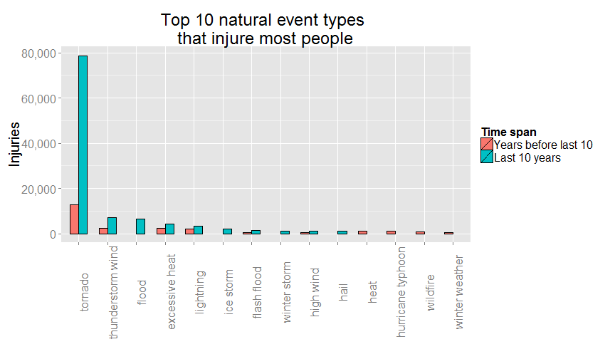
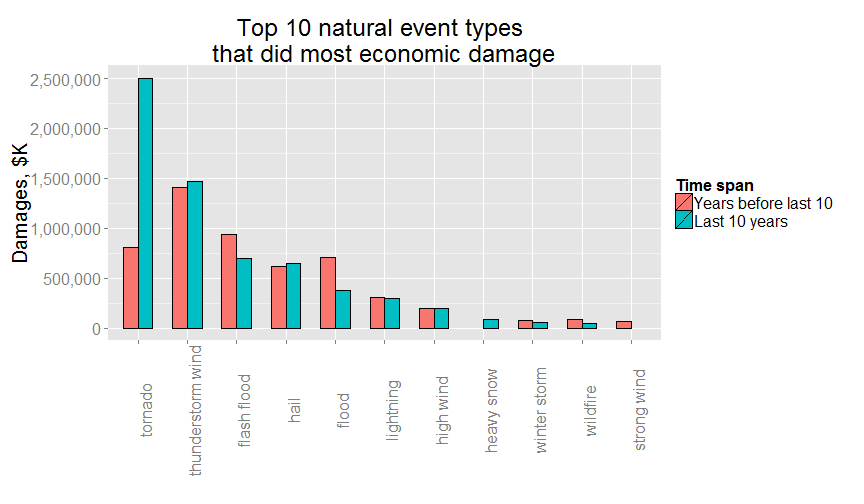

Reproducible Research, Peer Assessment 2
========================================

## Questions

1. Across the United States, which types of events (as indicated in the EVTYPE variable) are most harmful with respect to population health?
2. Across the United States, which types of events have the greatest economic consequences?


```r
require(data.table) # for faster summary stats
```

```
## Loading required package: data.table
```

```r
require(reshape)    # for setting up for ggplot2
```

```
## Loading required package: reshape
```

```r
require(ggplot2)    # for plotting
```

```
## Loading required package: ggplot2
```

```r
require(scales)     # for pretty numbers on plots
```

```
## Loading required package: scales
```

```r
setInternet2(TRUE)  # for https downloads.

# So that data.table won't trick knitr into printing the data:
# (http://stackoverflow.com/questions/15267018/knitr-gets-tricked-by-data-table-assignment)
assign("depthtrigger", 80, data.table:::.global)
```

## Data


```r
# Download is slow, and read.csv() from large .bz2 file is even slower.
# So, to speed things up, you could do it once and save an .RData version.
# I know this is not 100% OK (Peng exhorts you to save no intermediary
# data files) but if .RData is not saved to GitHub, all is well: any 
# customer who forks the code will have no choice but do download and 
# read.csv() the first time around.
if(!file.exists('StormData.RData')) {
    here  <- tempdir()
    myurl <- 'https://d396qusza40orc.cloudfront.net/repdata/data/StormData.csv.bz2'
    data  <- paste(here,'StormData.csv.bz2',sep='/')
    download.file(myurl,data)
    data <- data.table(read.csv(data, stringsAsFactors=FALSE))
    save(data,file='StormData.RData')
} else {
    load('StormData.RData')
}
# Transform the date of interest from string to true date
data$BGN_DATE <- as.Date(sapply(data$BGN_DATE,
                                function(x) {
                                    unlist(strsplit(x," "))[1]
                                }),"%m/%d/%Y")
```

One readily apparent problem with the data is that event types are not consistently named. This, if left unattended, might make summaries by event type inaccurate. 

For example, there are 985 unique event values in the data set, but if EVTYPE is forced to all lowercase there remain 898 of them. This would be an easy fix, but there are also plurals, idiosyncratic spaces -- e.g. "W IND" -- strange constructs such as both "WINTER MIX" and "WINTERY MIX", and the most amazing variety of spelling the word "thunderstorm". Some of these things can be fixed with regular-expression matching, as below:


```r
data <- subset(data, !(EVTYPE %in% EVTYPE[grep('^(summary|monthly)',EVTYPE,ignore.case=TRUE)]))

# Things I'm going to do to EVTYPE
events <- tolower(data[,EVTYPE])
foo <- length(unique(events))
events <- gsub('\\\\|&|/|(-\\s)|\\s+|;',' ',events)
events <- gsub('\\s+',' ',events)
events <- gsub('^\\s','',events)
events <- gsub('\\s$|-$|\\.$','',events)
events <- gsub('(wintery|wintry)','winter',events)
events <- gsub('micoburst','microburst',events)
events <- gsub('wayterspout','waterspout',events)
events <- gsub('waterspout-tornado','waterspout tornado',events)
events <- gsub('flooding|fldg|fld|floodin','flood',events)
events <- gsub('(sml stream)|(small strm)','small stream',events)
events <- gsub('tstm|thunderstrom|thunerstorm|thundertsorm|
               thundertorm|thundestorm|thuderstorm','thunderstorm',events)
events <- gsub('tunderstorm|thunderestorm|thundeerstorm|
               thunderstorms|thundertorm','thunderstorm',events)
events <- gsub('thunderstorms','thunderstorm',events)
events <- gsub('thunderstorm w inds','thunderstorm wind',events)
events <- gsub('thunderstormw winds','thunderstorm wind',events)
events <- gsub('thunderstormwinds','thunderstorm wind',events)
events <- gsub('(thunderstorm wnd)|(thunderstorm wins)',
               'thunderstorm wind',events)
events <- gsub('(thunderstorm damage)|(thunderstorm damage to)','thunderstorm',events)
events <- gsub('thunderstorm wind.+','thunderstorm wind',events)
events <- gsub('thunderstormw.+|thunderstormw','thunderstorm',events,perl=TRUE)
events <- gsub('wild fire','wildfire',events)
events <- gsub('unseasonal|unseasonable','unseasonably',events)
events <- gsub('tornados|torndao|tornadoes','tornado',events)
events <- gsub('tornado f.','tornado',events)
events <- gsub('^hail\\s[0-9]+','hail',events)
events <- gsub('^hail\\.[0-9]+','hail',events)
events <- gsub('^hail\\(0\\.[0-9]+\\)','hail',events)
events <- gsub('^high winds\\s[0-9]+','high winds',events)
events <- gsub('^high wind\\s[0-9]+','high wind',events)
events <- gsub('^high wind\\s\\([a-z][0-9]+\\)','high wind',events)
events <- gsub('^high winds','high wind',events)
events <- gsub('^dry microburst\\s[0-9]+','dry microburst',events)
events <- gsub('wnd','wind',events)
events <- gsub('winds$','wind',events)
events <- gsub('fires$','fire',events)
events <- gsub('storms$','storm',events)
events <- gsub('chil$','chill',events)
events <- gsub('win$','wind',events)
events <- gsub('waterspouts$|(water spout)','waterspout',events)
events <- gsub('rain \\(heavy\\)','heavy rain',events)
events <- gsub('lake-effect','lake effect',events)
events <- gsub(' \\(minor$','',events)
events <- gsub('snow-squalls','snow squalls',events)
events <- gsub('(heavy rains)|(heavy rainfall)','heavy rain',events)
events <- gsub('andblowing snow','blowing snow',events)
events <- gsub('and','',events)
events <- gsub('cstl','coastal',events)
events <- gsub('erosin','erosion',events)
events <- gsub(' and$','',events)
events <- gsub('squalls$','squall',events)
events <- gsub('coastalflood','coastal flood',events)
events <- gsub('coastalstorm','coastal storm',events)
events <- gsub('\\s+|,',' ',events)
events <- gsub('lslides','lslide',events)
events <- gsub('(\\s|\\))$','',events)
events <- gsub('precip$','precipitation',events)
events <- gsub('rip currents','rip current',events)
events <- gsub('wild forest fire','wildfire',events)
bar <- length(unique(events))

data[,EVTYPE:=events] # make all a consistent case
```

Excluding summaries, I started with 828 unique event types, and after tidying up a bit as shown above, I ended up with 545 unique event types. I'm not claiming that I caught every source of event type confusion, but surely this is an improvement over the original set.

## Ranking of event types by injuries and fatalities


```r
myn <- 10 # Top myn causes of injuries, fatalities. Set to suit.
myy <- 10 # Most recent years of data to consider separately. Set to suit.

oldest <- min(year(data$BGN_DATE))
newest <- max(year(data$BGN_DATE))
oldesty <- subset(data,year(BGN_DATE) %in% c(oldest:oldest+(myy-1)))
newesty <- subset(data,year(BGN_DATE) %in% c(newest-(myy-1):newest))

# summarize data: add losses of interest by event type.
# returns a data table.
getLossSum <- function(dt) {
    out <- dt[,list(fatalities=sum(FATALITIES), 
                    injuries=sum(INJURIES),
                    cropdmg=sum(CROPDMG),
                    propdmg=sum(PROPDMG)),
              by=list(EVTYPE)]
    out[,econdmg:=cropdmg+propdmg]
    return(subset(out,select=-c(cropdmg,propdmg)))
}

# report damage. 2 arguments:
# dt -- a data table summarized by getLossSum()
# thisn -- how many observations in the head() call
# returns a list with as many elements as there are
# metrics of interest. In this case, 3:
# fatalities, injuries, econdmg.
# each element is a data table.
getLoss <- function(dt,thisn=myn) {
    myx <- setdiff(names(dt),'EVTYPE')
    getTopset <- function(x) {
        return(head(subset(dt,select=c(EVTYPE,get(x)))[order(-get(x)),],n=thisn))
    }
    out <- lapply(myx,FUN=getTopset)
    names(out) <- myx
    return(out)
}

# get share of event types listed
# in string vector e for loss x
# in data table dt. returns a number 
# with a value between 0 and 1.
getShareOfLoss <- function(e,x,dt) {
    num <- sum(dt[,get(x)][dt[,EVTYPE] %in% e],na.rm=TRUE)
    den <- sum(dt[,get(x)],na.rm=TRUE)
    return(num/den)
}

# get data frame of top losses of all times and
# from newest myn years, from lists produced
# by getLoss()
getLossTable <- function(x,all,new) {
    out <- merge(all[[x]],new[[x]],by=c('EVTYPE'),all=TRUE)
    oldnames <- c('EVTYPE',paste(x,'x',sep='.'),paste(x,'y',sep='.'))
    newnames <- c('EVTYPE',paste('all',x,sep='.'),paste('last',myn,'years',sep='.'))
    setnames(out,oldnames,newnames)
    return(out[order(-get(paste('all',x,sep='.'))),])
}

# Get summarized data tables. 
# This is the analytical data.
peoplesum <- getLossSum(data)
peoplenew <- getLossSum(newesty)
```

There are 545 event types in the StormData data set, tracked over 61 years, between 1950 and 2011. These events were responsible for 15,145 fatalities and 140,528 injuries. Over time, the number of event types tracked grew from 3 over the first 10 years data to 534 over the last 10.


```r
allLoss <- getLoss(peoplesum)
newLoss <- getLoss(peoplenew)
fatalities <- getLossTable('fatalities',allLoss,newLoss)
injuries   <- getLossTable('injuries',allLoss,newLoss)
overlap    <- intersect(fatalities$EVTYPE,injuries$EVTYPE)
econdmg    <- getLossTable('econdmg',allLoss,newLoss)
```

Top 10 types of weather events that kill or injure most people, and their overlap:

```r
fatalities[,EVTYPE:=factor(EVTYPE,levels=fatalities[,EVTYPE])]
injuries[,EVTYPE:=factor(EVTYPE,levels=injuries[,EVTYPE])]

pf <- ggplot(data=melt(fatalities,id=1), aes(x=EVTYPE, y=value, fill=variable)) + 
    geom_bar(stat="identity", position=position_dodge(), colour="black") + 
    scale_y_continuous(name="Fatalities",labels=comma) +
    scale_x_discrete(name="Event type") +
    scale_fill_discrete(name="Time span",
                        labels=c("All data",paste("Last",myy,"years",sep=" "))) +
    ggtitle(paste("Top",myn,
                  "natural event types \nthat kill most people",sep=" ")) +
    theme(text = element_text(size=20), 
    axis.text.x = element_text(angle=90, vjust=1))


pi <- ggplot(data=melt(injuries,id=1), aes(x=EVTYPE, y=value, fill=variable)) + 
    geom_bar(stat="identity", position=position_dodge(), colour="black") + 
    scale_y_continuous(name="Injuries",labels=comma) +
    scale_x_discrete(name="Event type") +
    scale_fill_discrete(name="Time span",
                        labels=c("All data",paste("Last",myy,"years",sep=" "))) +
    ggtitle(paste("Top",myn,
                  "natural event types \nthat injure most people",sep=" ")) +
    theme(text = element_text(size=20), 
    axis.text.x = element_text(angle=90, vjust=1))

pf
```

 

```r
pi
```

 

```r
t(t(overlap))
```

```
##      [,1]               
## [1,] "tornado"          
## [2,] "excessive heat"   
## [3,] "flash flood"      
## [4,] "heat"             
## [5,] "lightning"        
## [6,] "thunderstorm wind"
## [7,] "flood"            
## [8,] "high wind"
```
    
The 8 types of events that show up in both top 10 bar plots, listed above, are responsible for 94% of fatalities and 97% of injuries in each top 10 list. This amounts to 78% of all recorded fatalities and 89% of all recorded injuries in the StormData file. These shares are almost identical to their counterparts over the last 10 years' worth of data only. Their shares of the top 10 most harmful events are 96% of fatalities and 96% of injuries. As to recorded totals over the past 10 years, the 8 contributed 81% of fatalities and 90% of injuries.

The list of top 10 most harmful types of events contains both "HEAT" and "EXCESSIVE HEAT". They are explained in sections 7.20 and 7.12 respectively of the [Storm Data documentation](https://d396qusza40orc.cloudfront.net/repdata%2Fpeer2_doc%2Fpd01016005curr.pdf), so there must be some good reason why they are treated separately.

The plots include a set of bars for only the last 10 years of data because it might be of interest to see how their heights compare: they make it clear that the casualty counts are disproportionately large over the past 10 years. This may be a normal consequence of having more people at risk from normal population increase.

Also, paired red and blue bars -- the case for most event types -- make it easy to see that the ranking of most catastrophic events has not changed much over time, though this may be the normal result of having the latest 10 years' counts carry so much weight in the totals of the worst events. This is especially obvious in the injuries plot.

In terms of both fatalities and injuries tornadoes are the top threat to human health among all natural events according to StormData by a wide margin. 

## Ranking of event types by economic damage

I added crop and property damage together into a single measure of economic damage, because they are both dollar values rounded to thousands. By this measure, the top 10 most costly types of weather events are (in thousands of dollars):

```r
overlap <- econdmg$EVTYPE

econdmg[,EVTYPE:=factor(EVTYPE,levels=econdmg[,EVTYPE])]

pe <- ggplot(data=melt(econdmg,id=1), aes(x=EVTYPE, y=value, fill=variable)) + 
    geom_bar(stat="identity", position=position_dodge(), colour="black") + 
    scale_y_continuous(name="Damages, $K",labels=comma) +
    scale_x_discrete(name="Event type") +
    scale_fill_discrete(name="Time span",
                        labels=c("All data",paste("Last",myy,"years",sep=" "))) +
    ggtitle(paste("Top",myn,
                  "natural event types \nthat did most economic damage",sep=" ")) +
    theme(text = element_text(size=20), 
    axis.text.x = element_text(angle=90, vjust=1))

pe
```

 

The types of events ranked above are responsible for 94% of all recorded economic damage in the StormData file. That share is 95% if measured over the last 10 years only. Again the shares are similar because the last 10 years' worth of estimates are disproportionately large, reflecting either higher-value property in harm's way (accounted for by both inflation and true wealth creation) or better data collection. 

Tornadoes top the list again, but by a much narrower margin.
